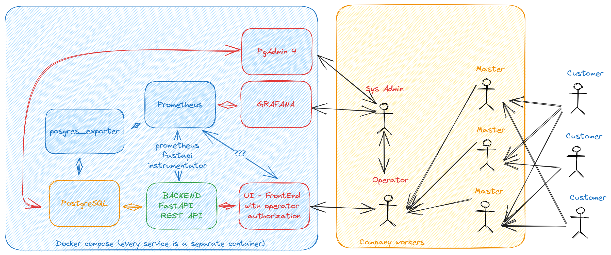

# Car service

## Architecture vision (v1)



Fix v1.1: FastAPI is no more, because of redundancy 

## Start service

```bash
docker-compose up -d 
make recreate_db # if not created yet
```

## Roadmap

- [x] FastAPI service scratch
- [x] Set up docker-compose for FastAPI
- [x] Set up log collection via prometheus
- [x] Set up log visualisation via grafana
- [x] UI service scratch
- [x] Set up docker-compose for UI
- [ ] Fix docker-compose so postgres uses configuration from file
- [x] Learn how to make authorization of operator's possible
